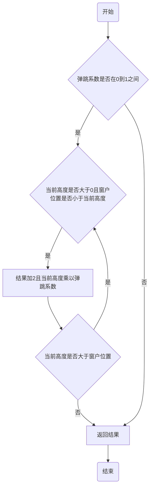
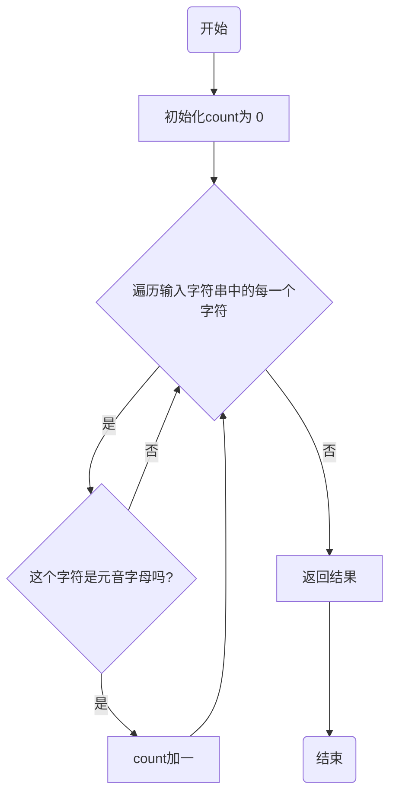
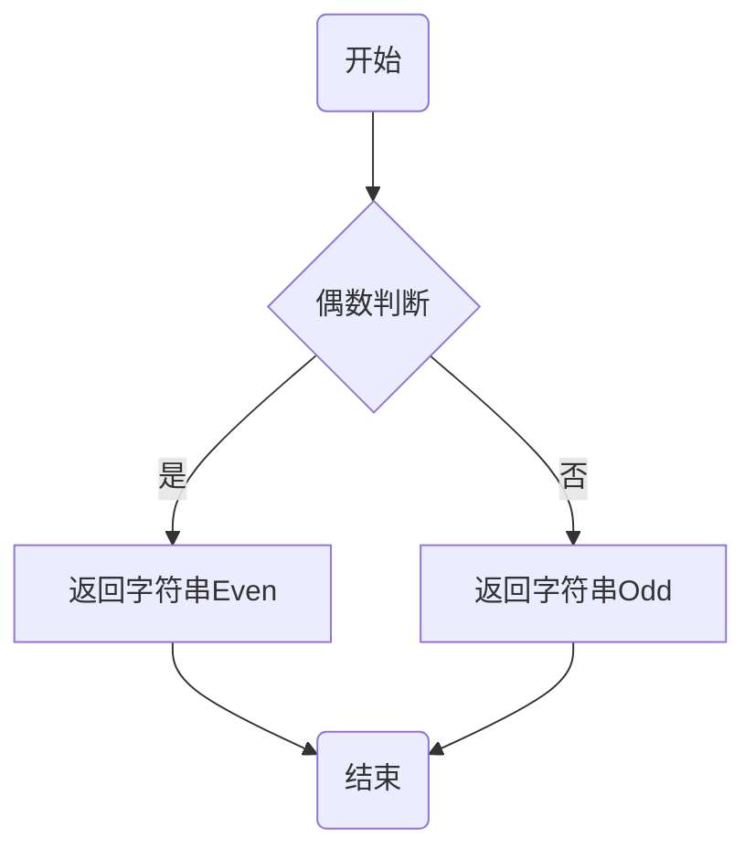

# 实验二 Python变量、简单数据类型

班级： 21计科3班

学号： B20210302303

姓名： 文凯

Github地址：<https://github.com/kaihuang614>

CodeWars地址：<https://www.codewars.com/users/kaihuang614>

---

## 实验目的

1. 使用VSCode编写和运行Python程序
2. 学习Python变量和简单数据类型

## 实验环境

1. Git
2. Python 3.10
3. VSCode
4. VSCode插件

## 实验内容和步骤

### 第一部分

实验环境的安装

1. 安装Python，从Python官网下载Python 3.10安装包，下载后直接点击可以安装：[Python官网地址](https://www.python.org/downloads/)
2. 为了在VSCode集成环境下编写和运行Python程序，安装下列VScode插件
   - Python
   - Python Environment Manager
   - Python Indent
   - Python Extended
   - Python Docstring Generator
   - Jupyter
   - indent-rainbow
   - Jinja

---

### 第二部分

Python变量、简单数据类型和列表简介

完成教材《Python编程从入门到实践》下列章节的练习：

- 第2章 变量和简单数据类型

---

### 第三部分

在[Codewars网站](https://www.codewars.com)注册账号，完成下列Kata挑战：

---

#### 第1题：求离整数n最近的平方数（Find Nearest square number）

难度：8kyu

你的任务是找到一个正整数n的最近的平方数
例如，如果n=111，那么nearest_sq(n)（nearestSq(n)）等于121，因为111比100（10的平方）更接近121（11的平方）。
如果n已经是完全平方（例如n=144，n=81，等等），你需要直接返回n。
代码提交地址
<https://www.codewars.com/kata/5a805d8cafa10f8b930005ba>

---

#### 第2题：弹跳的球（Bouncing Balls）

难度：6kyu

一个孩子在一栋高楼的第N层玩球。这层楼离地面的高度h是已知的。他把球从窗口扔出去。球弹了起来,  例如:弹到其高度的三分之二（弹力为0.66）。他的母亲从离地面w米的窗户向外看,母亲会看到球在她的窗前经过多少次（包括球下落和反弹的时候）？

一个有效的实验必须满足三个条件：

- 参数 "h"（米）必须大于0
- 参数 "bounce "必须大于0且小于1
- 参数 “window "必须小于h。

如果以上三个条件都满足，返回一个正整数，否则返回-1。
**注意:只有当反弹球的高度严格大于窗口参数时，才能看到球。**
代码提交地址
<https://www.codewars.com/kata/5544c7a5cb454edb3c000047/train/python>

---

#### 第3题： 元音统计(Vowel Count)

难度： 7kyu

返回给定字符串中元音的数量（计数）。对于这个Kata，我们将考虑a、e、i、o、u作为元音（但不包括y）。输入的字符串将只由小写字母和/或空格组成。

代码提交地址：
<https://www.codewars.com/kata/54ff3102c1bad923760001f3>

---

#### 第4题：偶数或者奇数（Even or Odd）

难度：8kyu

创建一个函数接收一个整数作为参数，当整数为偶数时返回”Even”当整数位奇数时返回”Odd”。
代码提交地址：
<https://www.codewars.com/kata/53da3dbb4a5168369a0000fe>

### 第四部分

使用Mermaid绘制程序流程图

安装Mermaid的VSCode插件：

- Markdown Preview Mermaid Support
- Mermaid Markdown Syntax Highlighting

## 实验过程与结果
请将实验过程与结果放在这里，包括：

- [第二部分 Python变量、简单数据类型和列表简介](#第二部分)
- [第三部分 Codewars Kata挑战](#第三部分)

第1题：求离整数n最近的平方数（Find Nearest square number）
```python
def nearest_sq(n):
    return round(n ** 0.5) ** 2
```
第2题：弹跳的球（Bouncing Balls）
```python
def bouncing_ball(h, bounce, window):
    res = -1
    if (bounce > 0 and bounce < 1):
        while (h > 0 and window < h):
            res += 2 
            h *= bounce
    return res
```
第3题： 元音统计(Vowel Count)
```python
def get_count(sentence):
    vowels = 'aeiou'
    count = 0
    for letter in sentence:
        if letter in vowels:
            count += 1
    return count
```
第4题：偶数或者奇数（Even or Odd）
```python
def even_or_odd(number):
    if (number & 1): return "Odd"
    return "Even"
```
- [第四部分 使用Mermaid绘制程序流程图](#第四部分)
  
第2题：弹跳的球（Bouncing Balls）


---

第3题： 元音统计(Vowel Count)


---
第4题：偶数或者奇数（Even or Odd）



## 实验考查

请使用自己的语言并使用尽量简短代码示例回答下面的问题，这些问题将在实验检查时用于提问和答辩以及实际的操作。

1. Python中的简单数据类型有那些？我们可以对这些数据类型做哪些操作？
```
Python中的简单数据类型包括整数（int）、浮点数（float）、
布尔值（bool）、字符串（str）和空值（None）。
对于这些数据类型，我们可以进行各种操作：
对于整数和浮点数，我们可以进行基本的数学运算（如加减乘除），
还可以进行比较操作（如大于、小于、等于）。
布尔值可以进行逻辑运算（如与、或、非），也可以进行比较操作。
字符串可以进行拼接、切片、替换等操作，
还有很多内置的字符串方法可以使用。
空值通常用于表示不存在或未定义的变量，不能进行任何操作。
```
```python
# int实操
a = 5
b = 3
c = a + b  # 加法
d = a * b  # 乘法
e = a > b  # 大于比较
f = bin(a)  # 转换为二进制字符串

# float实操
a = 3.14
b = 2.0
c = a + b  # 加法
d = a * b  # 乘法
e = a > b  # 大于比较
f = int(a)  # 转换为整数

# bool实操
a = True
b = False
c = a and b  # 与运算
d = a or b  # 或运算
e = not a  # 非运算
f = int(a)  # 转换为整数

# str实操
a = "Hello"
b = "World"
c = a + b  # 字符串拼接
d = a * 3  # 字符串重复
e = a[1:3]  # 字符串切片
f = len(a)  # 字符串长度
g = a.replace("H", "J")  # 字符串替换
```

2. 为什么说Python中的变量都是标签？
```
在Python中，变量被称为标签（label），
是因为 Python 中的变量实际上是对象的引用。
当我们创建一个变量并将其赋值给一个对象时，
实际上是将该变量标签贴在了这个对象上。
Python 是一种动态类型语言，不需要在声明变量时指定其类型。
当我们给一个变量赋值时，解释器会根据赋予的对象类型
自动确定变量的类型。
这种动态特性使得 Python 的变量更加灵活。
```

3. 有哪些方法可以提高Python代码的可读性？
```
有以下几种方法可以提高Python代码的可读性：

1. 使用有意义的变量名：变量名应该能够清晰地表达变量的含义
，避免使用 过于简单或无意义的名称。
2. 适当添加注释：在关键位置添加注释，描述代码的功能和实现思路，
方便其他人理解和维护。
3. 使用空格和缩进：合理使用空格和缩进来组织代码结构，使其更易读，
同时遵循Python的缩进规则。
4. 模块化和函数化：将代码分解为逻辑单元的函数或模块，
提高代码的可维护性和重用性。
5. 合理命名函数和方法：函数和方法的命名应该清晰地表达其功能，
遵循命名规范，使其易于理解。
6. 拆分长行：当一行代码过长时，可以使用括号或反斜杠
将其拆分为多行，以提高可读性。
7. 使用合适的空行和代码块分割：使用空行和适当的代码块
分割来增加代码的可读性，使其更易理解逻辑结构。
```

## 实验总结

总结一下这次实验你学习和使用到的知识，例如：编程工具的使用、数据结构、程序语言的语法、算法、编程技巧、编程思想。
完成实验2，我的收获如下：
 - 这次实验学习了Mermaid流程图语法，学会了如何将算法思路转换成Mermaid流程图。
 - 做了codewars上面不同难度的题目，这对我熟悉python的基本语法很有帮助。
