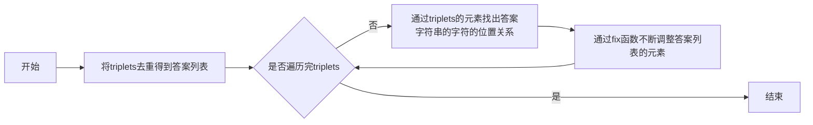

# 实验三 Python列表

班级： 21计科3班

学号： B20210302303

姓名： 文凯

Github地址：<https://github.com/kaihuang614>

CodeWars地址：<https://www.codewars.com/users/kaihuang614>

---

## 实验目的

1. 学习Python的简单使用和列表操作
2. 学习Python中的if语句

## 实验环境

1. Git
2. Python 3.10
3. VSCode
4. VSCode插件

## 实验内容和步骤

### 第一部分

Python列表操作

完成教材《Python编程从入门到实践》下列章节的练习：

- 第3章 列表简介
- 第4章 操作列表
- 第5章 if语句

---

### 第二部分

在[Codewars网站](https://www.codewars.com)注册账号，完成下列Kata挑战：

---

#### 第一题：3和5的倍数（Multiples of 3 or 5）

难度： 6kyu

如果我们列出所有低于 10 的 3 或 5 倍数的自然数，我们得到 3、5、6 和 9。这些数的总和为 23. 完成一个函数，使其返回小于某个整数的所有是3 或 5 的倍数的数的总和。此外，如果数字为负数，则返回 0。

注意：如果一个数同时是3和5的倍数，应该只被算一次。

**提示：首先使用列表解析得到一个列表，元素全部是3或者5的倍数。
使用sum函数可以获取这个列表所有元素的和.**

代码提交地址：
<https://www.codewars.com/kata/514b92a657cdc65150000006>

---

#### 第二题： 重复字符的编码器（Duplicate Encoder）

难度： 6kyu

本练习的目的是将一个字符串转换为一个新的字符串，如果新字符串中的每个字符在原字符串中只出现一次，则为"("，如果该字符在原字符串中出现多次，则为")"。在判断一个字符是否是重复的时候，请忽略大写字母。

例如:

```python
"din"      =>  "((("
"recede"   =>  "()()()"
"Success"  =>  ")())())"
"(( @"     =>  "))(("
```

代码提交地址:
<https://www.codewars.com/kata/54b42f9314d9229fd6000d9c>

---

#### 第三题：括号匹配（Valid Braces）

难度：6kyu

写一个函数，接收一串括号，并确定括号的顺序是否有效。如果字符串是有效的，它应该返回True，如果是无效的，它应该返回False。
例如：

```python
"(){}[]" => True 
"([{}])" => True
 "(}" => False
 "[(])" => False 
"[({})](]" => False
```

**提示：
python中没有内置堆栈数据结构，可以直接使用`list`来作为堆栈，其中`append`方法用于入栈，`pop`方法可以出栈。**

代码提交地址
<https://www.codewars.com/kata/5277c8a221e209d3f6000b56>

---

#### 第四题： 从随机三元组中恢复秘密字符串(Recover a secret string from random triplets)

难度： 4kyu

有一个不为你所知的秘密字符串。给出一个随机三个字母的组合的集合，恢复原来的字符串。

这里的三个字母的组合被定义为三个字母的序列，每个字母在给定的字符串中出现在下一个字母之前。"whi "是字符串 "whatisup "的一个三个字母的组合。

作为一种简化，你可以假设没有一个字母在秘密字符串中出现超过一次。

对于给你的三个字母的组合，除了它们是有效的三个字母的组合以及它们包含足够的信息来推导出原始字符串之外，你可以不做任何假设。特别是，这意味着秘密字符串永远不会包含不出现在给你的三个字母的组合中的字母。

测试用例：

```python
secret = "whatisup"
triplets = [
  ['t','u','p'],
  ['w','h','i'],
  ['t','s','u'],
  ['a','t','s'],
  ['h','a','p'],
  ['t','i','s'],
  ['w','h','s']
]
test.assert_equals(recoverSecret(triplets), secret)
```

代码提交地址：
<https://www.codewars.com/kata/53f40dff5f9d31b813000774/train/python>

提示：

- 利用集合去掉`triplets`中的重复字母，得到字母集合`letters`，最后的`secret`应该由集合中的字母组成，`secret`长度也等于该集合。

```python
letters = {letter for triplet in triplets for letter in triplet }
length = len(letters)
```

- 创建函数`check_first_letter(triplets, first_letter)`，检测一个字母是不是secret的首字母，返回True或者False。
- 创建函数`remove_first_letter(triplets, first_letter)`,  从三元组中去掉首字母，返回新的三元组。
- 遍历字母集合letters，利用上面2个函数得到最后的结果`secret`。

---

#### 第五题： 去掉喷子的元音（Disemvowel Trolls）

难度： 7kyu

喷子正在攻击你的评论区!
处理这种情况的一个常见方法是删除喷子评论中的所有元音(字母：a,e,i,o,u)，以消除威胁。
你的任务是写一个函数，接收一个字符串并返回一个去除所有元音的新字符串。
例如，字符串 "This website is for losers LOL!"   将变成 "Ths wbst s fr lsrs LL!".

注意：对于这个Kata来说，y不被认为是元音。
代码提交地址：
<https://www.codewars.com/kata/52fba66badcd10859f00097e>

提示：

- 首先使用列表解析得到一个列表，列表中所有不是元音的字母。
- 使用字符串的join方法连结列表中所有的字母，例如：

```python
last_name = "lovelace"
letters = [letter for letter in last_name ]
print(letters) # ['l', 'o', 'v', 'e', 'l', 'a', 'c', 'e']
name = ''.join(letters) # name = "lovelace"
```

---

### 第三部分

使用Mermaid绘制程序流程图

安装VSCode插件：

- Markdown Preview Mermaid Support
- Mermaid Markdown Syntax Highlighting

## 实验过程与结果

请将实验过程与结果放在这里，包括：

- [第一部分 Python列表操作和if语句](#第一部分)
- [第二部分 Codewars Kata挑战](#第二部分)

第一题：3和5的倍数（Multiples of 3 or 5）
```python
def solution(number):
    res = 0
    for x in range(number):
        if (x % 3 == 0 or x % 5 == 0): res += x
    return res
```

第二题： 重复字符的编码器（Duplicate Encoder）
```python
def duplicate_encode(word):
    res = ""#答案
    zidian = {}#使用字典来记录每个字符在所给字符串中的出现次数
    word_lower = word.lower()#将所给字符串转换成小写字符串，避免判断大小写
    
    for x in word_lower:
        if x in zidian:#不是第一次在字典出现，累加次数
            zidian[x] += 1
        else:
            zidian[x] = 1#第一次在字典出现
            
    for x in word_lower:
        if zidian[x] > 1: res += ')'#不是第一次出现，用右括号替换
        else: res += '('#是第一次出现，用左括号替换
        
    return res
``` 

第三题：括号匹配（Valid Braces）
```python
def valid_braces(string):
    str_list = []#空list模拟栈
    
    for x in string:
        if x == '(' or x == '[' or x == '{':
            str_list.append(x)#为左括号加入栈等待右括号匹配
        else:
            if x == ')' and str_list and str_list[-1] == '(': 
                str_list.pop()#出栈
            if x == ']' and str_list and str_list[-1] == '[': 
                str_list.pop()#出栈
            if x == '}' and  str_list and str_list[-1] == '{':
                str_list.pop()#出栈

    if str_list: return False#如果栈里面还有元素，说明匹配失败，返回False
    return True#栈为空，匹配成功，返回True
```

第四题： 从随机三元组中恢复秘密字符串(Recover a secret string from random triplets)
```python
def recoverSecret(triplets):
    res = list({i for t in triplets for i in t})#根据triplets生成原字符串的字符列表，无重复，但非按顺序。
    for t in triplets * 2:#循环遍历triplets，每次循环按三字符列表中的顺序调整res中字符顺序。
        fix(res, t[0], t[1])
        fix(res, t[1], t[2])
    return ''.join(res)

def fix(t, a, b):
    if t.index(a) > t.index(b):
        t.remove(a)
        t.insert(t.index(b), a)
```

第五题： 去掉喷子的元音（Disemvowel Trolls）
```python
def disemvowel(string_):
    res = ''
    yuan = 'aeiouAEIOU'#元音字符串包括所有元音的大小写
    for x in string_:
        if x not in yuan:
            res += x
    return res
```

- [第三部分 使用Mermaid绘制程序流程图](#第三部分)

第四题： 从随机三元组中恢复秘密字符串(Recover a secret string from random triplets)


## 实验考查

请使用自己的语言并使用尽量简短代码示例回答下面的问题，这些问题将在实验检查时用于提问和答辩以及实际的操作。

1. Python中的列表可以进行哪些操作？

```
在Python中，列表是一种可变的有序集合，可以存储任意类型的元素。以下是一些常见的列表操作：

1、创建列表：
my_list = [1, 2, 3, 4, 5]

2、访问列表元素：
print(my_list[0])  # 输出第一个元素
print(my_list[-1])  # 输出最后一个元素

3、修改列表元素：
my_list[0] = 10  # 将第一个元素修改为10

4、添加元素到列表末尾：
my_list.append(6)  # 在列表末尾添加元素6

5、插入元素到指定位置：
my_list.insert(2, 7)  # 在索引2处插入元素7

6、删除列表中的元素：
del my_list[0]  # 删除第一个元素
my_list.remove(3)  # 删除值为3的元素

7、切片操作：
sub_list = my_list[1:3]  # 获取索引1到2的子列表

8、列表长度：
length = len(my_list)  # 获取列表长度

9、列表排序：
my_list.sort()  # 对列表进行升序排序

10、列表反转：
my_list.reverse()  # 反转列表元素的顺序
```

2. 哪两种方法可以用来对Python的列表排序？这两种方法有和区别？

```
在Python中，可以使用两种方法对列表进行排序：sort() 方法和 sorted() 函数。

1、使用 sort() 方法对列表进行排序：
sort() 方法是列表对象的方法，直接在原列表上进行排序，不返回新的排序后的列表。
排序是原地进行的，即列表的元素顺序会被修改。
排序结果是升序（从小到大）。

示例代码：
my_list = [3, 1, 4, 2, 5]
my_list.sort()
print(my_list)  # 输出：[1, 2, 3, 4, 5]

2、使用 sorted() 函数对列表进行排序：
sorted() 函数接受一个可迭代对象作为参数，并返回一个新的排序后的列表。
排序不影响原列表的顺序，返回的是排序后的新列表。
排序结果是升序（从小到大）。

示例代码：
my_list = [3, 1, 4, 2, 5]
sorted_list = sorted(my_list)
print(sorted_list)  # 输出：[1, 2, 3, 4, 5]

这两种方法的不同之处在于对列表的处理方式和返回结果。如果想原地修改列表并且不需要返回新的排序后的列表，可以使用 sort() 方法；如果想保留原列表不变，并获取一个排序后的新列表，可以使用 sorted() 函数。
```

3. 如何将Python列表逆序打印？

```
要将Python列表逆序打印，可以使用切片操作和步长为负数的方式和使用 reverse() 方法。

使用切片操作和步长为负数的方式
代码示例：
my_list = [1, 2, 3, 4, 5]
reversed_list = my_list[::-1]
print(reversed_list)  # 输出：[5, 4, 3, 2, 1]
在上述代码示例中，[::-1] 表示使用步长为负数的切片操作，从列表的末尾开始逆序遍历，然后返回一个新的逆序列表 reversed_list。
注意,这种方法不会修改原列表 my_list 的顺序，只是返回一个新的逆序列表。

如果希望修改原列表的顺序，可以使用 reverse() 方法：
代码示例：
my_list = [1, 2, 3, 4, 5]
my_list.reverse()
print(my_list)  # 输出：[5, 4, 3, 2, 1]
上述代码示例中的 reverse() 方法会原地修改列表的顺序，使其逆序排列。
```

4. Python中的列表执行哪些操作时效率比较高？哪些操作效率比较差？是否有类似的数据结构可以用来替代列表？

```
在Python中，列表执行以下操作时效率比较高：

1、访问元素：通过索引直接访问列表中的元素，时间复杂度为 O(1)。

2、添加元素到列表末尾：使用 append() 方法将元素添加到列表的末尾，时间复杂度为 O(1)。

3、切片操作：通过切片操作获取列表的子列表，时间复杂度为 O(n)，其中 n 是切片的长度。

4、检查元素是否存在：使用 in 关键字可以快速检查一个元素是否存在于列表中，时间复杂度为 O(n)，其中 n 是列表的长度。

列表执行以下操作时效率比较低：

1、插入或删除指定位置的元素：使用 insert() 方法在指定位置插入元素，或使用 del 关键字或 remove() 方法删除指定位置的元素，这些操作的平均时间复杂度为 O(n)，其中 n 是列表的长度。因为这些操作会导致元素的移动。

2、列表拼接：使用 + 运算符将两个列表拼接在一起，这个操作的时间复杂度为 O(m)，其中 m 是第二个列表的长度。

如果需要在执行插入和删除操作时具有更高的效率，可以考虑使用其他数据结构，例如链表。链表在插入和删除操作上具有更好的时间复杂度，但在访问元素时的效率较低。在Python中，可以使用第三方库（例如 llist）实现链表数据结构。

以下是一个简短的代码示例，展示了如何使用 llist 库创建链表并执行插入和删除操作：

from llist import sllist

my_linked_list = sllist([1, 2, 3, 4, 5])

my_linked_list.append(6)  # 在链表末尾添加元素6

my_linked_list.insert(2, 7)  # 在索引2处插入元素7

del my_linked_list[0]  # 删除第一个元素

my_linked_list.remove(3)  # 删除值为3的元素
```

5. 阅读《Fluent Python》Chapter 2. An Array of Sequence - Tuples Are Not Just Immutable Lists小节（p30-p35）。总结该小节的主要内容。

```
该小节主要介绍了元组的特点、用法和与列表的区别。以下是对该小节的主要内容的总结：

1、元组是不可变的序列：元组是一种不可变的序列类型，一旦创建就不能修改。不可变性使得元组具有一些特殊的特点和用途。

2、元组的构造和初始化：元组可以通过逗号分隔的值列表来创建。可以使用圆括号括起来，也可以省略括号。

3、元组的拆包：元组可以进行拆包，将元组的元素赋值给多个变量。拆包可以用于交换变量值、函数返回多个值等情况。

4、命名元组：collections 模块提供了 namedtuple 函数，用于创建具有字段名的命名元组。命名元组可以像普通元组一样使用索引访问元素，同时也可以通过字段名访问元素，提高可读性和代码的可维护性。

5、元组与列表的不同之处：
元组是不可变的，而列表是可变的。
元组通常用于存储异构数据，而列表通常用于存储同构数据。
元组可以作为字典的键，而列表不可以。
元组可以作为集合的元素，而列表不可以。
元组的不可变性使得它们可以作为函数的参数，而列表则更适合用于修改数据。

6、元组的作用：元组在多个方面都有其独特的用途，例如在函数返回多个值时、作为字典的键值对、作为集合的元素等。元组还可以用于创建不可变的记录，以及在并行赋值、迭代和解包操作中。
```

## 实验总结

总结一下这次实验你学习和使用到的知识，例如：编程工具的使用、数据结构、程序语言的语法、算法、编程技巧、编程思想。

完成实验3，我的收获如下：

- 这次实验学习了python的列表操作和if语句，并做了相关练习来熟悉相关语法。
-  阅读了《Fluent Python》Chapter 2. An Array of Sequence - Tuples Are Not Just Immutable Lists小节（p30-p35），知道了元组的特点、用法和与列表的区别。
- 做了codewars上面不同难度的题目，这对我熟悉python的基本语法很有帮助。
