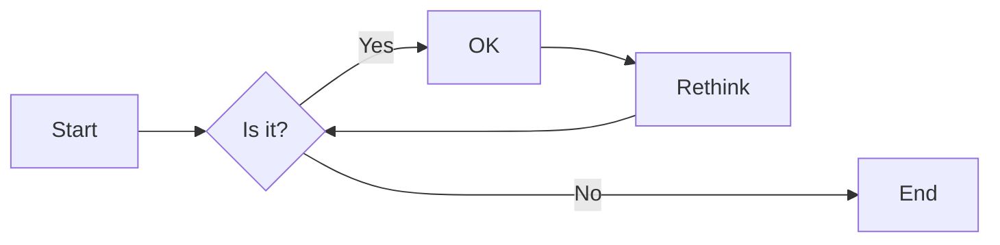
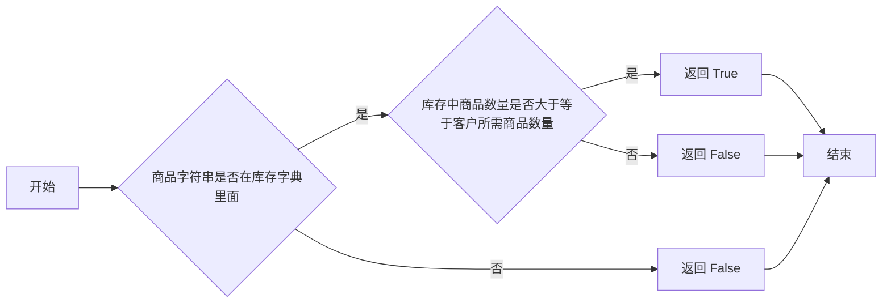

# 实验四 Python字典和while循环

班级： 21计科3班

学号： B20210302303

姓名： 文凯

Github地址：<https://github.com/kaihuang614>

CodeWars地址：<https://www.codewars.com/users/kaihuang614>

---

## 实验目的

1. 学习Python字典
2. 学习Python用户输入和while循环

## 实验环境

1. Git
2. Python 3.10
3. VSCode
4. VSCode插件

## 实验内容和步骤

### 第一部分

Python列表操作

完成教材《Python编程从入门到实践》下列章节的练习：

- 第6章 字典
- 第7章 用户输入和while循环

---

### 第二部分

在[Codewars网站](https://www.codewars.com)注册账号，完成下列Kata挑战：

---

#### 第一题：淘气还是乖孩子（Naughty or Nice）

难度： 7kyu

圣诞老人要来镇上了，他需要你帮助找出谁是淘气的或善良的。你将会得到一整年的JSON数据，按照这个格式：

```python
{
    January: {
        '1': 'Naughty','2': 'Naughty', ..., '31': 'Nice'
    },
    February: {
        '1': 'Nice','2': 'Naughty', ..., '28': 'Nice'
    },
    ...
    December: {
        '1': 'Nice','2': 'Nice', ..., '31': 'Naughty'
    }
}
```

你的函数应该返回 "Naughty!"或 "Nice!"，这取决于在某一年发生的总次数（以较大者为准）。如果两者相等，则返回 "Nice！"。
代码提交地址：
<https://www.codewars.com/kata/5662b14e0a1fb8320a00005c>

---

#### 第二题： 观察到的PIN（The observed PIN）

难度：4kyu

好了，侦探，我们的一个同事成功地观察到了我们的目标人物，抢劫犯罗比。我们跟踪他到了一个秘密仓库，我们认为在那里可以找到所有被盗的东西。这个仓库的门被一个电子密码锁所保护。不幸的是，我们的间谍不确定他看到的密码，当罗比进入它时。

键盘的布局如下：

```python
┌───┬───┬───┐
│ 1 │ 2 │ 3 │
├───┼───┼───┤
│ 4 │ 5 │ 6 │
├───┼───┼───┤
│ 7 │ 8 │ 9 │
└───┼───┼───┘
    │ 0 │
    └───┘
```

他注意到密码1357，但他也说，他看到的每个数字都有可能是另一个相邻的数字（水平或垂直，但不是对角线）。例如，代替1的也可能是2或4。而不是5，也可能是2、4、6或8。

他还提到，他知道这种锁。你可以无限制地输入错误的密码，但它们最终不会锁定系统或发出警报。这就是为什么我们可以尝试所有可能的（*）变化。

*可能的意义是：观察到的PIN码本身和考虑到相邻数字的所有变化。

你能帮助我们找到所有这些变化吗？如果有一个函数，能够返回一个列表，其中包含一个长度为1到8位的观察到的PIN的所有变化，那就更好了。我们可以把这个函数命名为getPINs（在python中为get_pins，在C#中为GetPINs）。

但请注意，所有的PINs，包括观察到的PINs和结果，都必须是字符串，因为有可能会有领先的 "0"。我们已经为你准备了一些测试案例。
侦探，我们就靠你了!
代码提交地址：
<https://www.codewars.com/kata/5263c6999e0f40dee200059d>

---

#### 第三题： RNA到蛋白质序列的翻译（c）

难度：6kyu

蛋白质是由DNA转录成RNA，然后转译成蛋白质的中心法则。RNA和DNA一样，是由糖骨架（在这种情况下是核糖）连接在一起的长链核酸。每个由三个碱基组成的片段被称为密码子。称为核糖体的分子机器将RNA密码子转译成氨基酸链，称为多肽链，然后将其折叠成蛋白质。

蛋白质序列可以像DNA和RNA一样很容易地可视化，作为大字符串。重要的是要注意，“停止”密码子不编码特定的氨基酸。它们的唯一功能是停止蛋白质的转译，因此它们不会被纳入多肽链中。“停止”密码子不应出现在最终的蛋白质序列中。为了节省您许多不必要（和乏味）的键入，已为您的氨基酸字典提供了键和值。

给定一个RNA字符串，创建一个将RNA转译为蛋白质序列的函数。注意：测试用例将始终生成有效的字符串。

```python
protein（'UGCGAUGAAUGGGCUCGCUCC'）
```

将返回`CDEWARS`

作为测试用例的一部分是一个真实世界的例子！最后一个示例测试用例对应着一种叫做绿色荧光蛋白的蛋白质，一旦被剪切到另一个生物体的基因组中，像GFP这样的蛋白质可以让生物学家可视化细胞过程！

Amino Acid Dictionary

```python
   # Your dictionary is provided as PROTEIN_DICT
   PROTEIN_DICT = {
    # Phenylalanine
    'UUC': 'F', 'UUU': 'F',
    # Leucine
    'UUA': 'L', 'UUG': 'L', 'CUU': 'L', 'CUC': 'L', 'CUA': 'L', 'CUG': 'L',
    # Isoleucine
    'AUU': 'I', 'AUC': 'I', 'AUA': 'I',
    # Methionine
    'AUG': 'M',
    # Valine
    'GUU': 'V', 'GUC': 'V', 'GUA': 'V', 'GUG': 'V',
    # Serine
    'UCU': 'S', 'UCC': 'S', 'UCA': 'S', 'UCG': 'S', 'AGU': 'S', 'AGC': 'S',
    # Proline
    'CCU': 'P', 'CCC': 'P', 'CCA': 'P', 'CCG': 'P',
    # Threonine
    'ACU': 'T', 'ACC': 'T', 'ACA': 'T', 'ACG': 'T',
    # Alanine
    'GCU': 'A', 'GCC': 'A', 'GCA': 'A', 'GCG': 'A',
    # Tyrosine
    'UAU': 'Y', 'UAC': 'Y',
    # Histidine
    'CAU': 'H', 'CAC': 'H',
    # Glutamine
    'CAA': 'Q', 'CAG': 'Q',
    # Asparagine
    'AAU': 'N', 'AAC': 'N',
    # Lysine
    'AAA': 'K', 'AAG': 'K',
    # Aspartic Acid
    'GAU': 'D', 'GAC': 'D',
    # Glutamic Acid
    'GAA': 'E', 'GAG': 'E',
    # Cystine
    'UGU': 'C', 'UGC': 'C',
    # Tryptophan
    'UGG': 'W',
    # Arginine
    'CGU': 'R', 'CGC': 'R', 'CGA': 'R', 'CGG': 'R', 'AGA': 'R', 'AGG': 'R',
    # Glycine
    'GGU': 'G', 'GGC': 'G', 'GGA': 'G', 'GGG': 'G',
    # Stop codon
    'UAA': 'Stop', 'UGA': 'Stop', 'UAG': 'Stop'
}
```

代码提交地址：
<https://www.codewars.com/kata/555a03f259e2d1788c000077>

---

#### 第四题： 填写订单（Thinkful - Dictionary drills: Order filler）

难度：8kyu

您正在经营一家在线业务，您的一天中很大一部分时间都在处理订单。随着您的销量增加，这项工作占用了更多的时间，不幸的是最近您遇到了一个情况，您接受了一个订单，但无法履行。

您决定写一个名为`fillable()`的函数，它接受三个参数：一个表示您库存的字典`stock`，一个表示客户想要购买的商品的字符串`merch`，以及一个表示他们想购买的商品数量的整数n。如果您有足够的商品库存来完成销售，则函数应返回`True`，否则应返回`False`。

有效的数据将始终被传入，并且n将始终大于等于1。

代码提交地址：
<https://www.codewars.com/kata/586ee462d0982081bf001f07/python>

---

#### 第五题： 莫尔斯码解码器（Decode the Morse code, advanced）

难度： 4kyu

在这个作业中，你需要为有线电报编写一个莫尔斯码解码器。
有线电报通过一个有按键的双线路运行，当按下按键时，会连接线路，可以在远程站点上检测到。莫尔斯码将每个字符的传输编码为"点"（按下按键的短按）和"划"（按下按键的长按）的序列。

在传输莫尔斯码时，国际标准规定：

- "点" - 1个时间单位长。
- "划" - 3个时间单位长。
- 字符内点和划之间的暂停 - 1个时间单位长。
- 单词内字符之间的暂停 - 3个时间单位长。
- 单词间的暂停 - 7个时间单位长。

但是，该标准没有规定"时间单位"有多长。实际上，不同的操作员会以不同的速度进行传输。一个业余人士可能需要几秒钟才能传输一个字符，一位熟练的专业人士可以每分钟传输60个单词，而机器人发射器可能会快得多。

在这个作业中，我们假设消息的接收是由硬件自动执行的，硬件会定期检查线路，如果线路连接（远程站点的按键按下），则记录为1，如果线路未连接（远程按键弹起），则记录为0。消息完全接收后，它会以一个只包含0和1的字符串的形式传递给你进行解码。

例如，消息`HEY JUDE`，即`···· · −·−−   ·−−− ··− −·· ·`可以如下接收：

```python
1100110011001100000011000000111111001100111111001111110000000000000011001111110011111100111111000000110011001111110000001111110011001100000011
```

如您所见，根据标准，这个传输完全准确，硬件每个"点"采样了两次。

因此，你的任务是实现两个函数：

函数decodeBits(bits)，应该找出消息的传输速率，正确解码消息为点（.）、划（-）和空格（字符之间有一个空格，单词之间有三个空格），并将它们作为一个字符串返回。请注意，在消息的开头和结尾可能会出现一些额外的0，确保忽略它们。另外，如果你无法分辨特定的1序列是点还是划，请假设它是一个点。

函数decodeMorse(morseCode)，它将接收上一个函数的输出，并返回一个可读的字符串。

注意：出于编码目的，你必须使用ASCII字符.和-，而不是Unicode字符。

莫尔斯码表已经预加载给你了（请查看解决方案设置，以获取在你的语言中使用它的标识符）。

```python
morseCodes(".--")  #to access the morse translation of ".--"
```

下面是Morse码支持的完整字符列表：

```javascript
A    ·–
B    –···
C    –·–·
D    –··
E    ·
F    ··–·
G    ––·
H    ····
I    ··
J    ·–––
K    –·–
L    ·–··
M    ––
N    –·
O    –––
P    ·––·
Q    ––·–
R    ·–·
S    ···
T    –
U    ··–
V    ···–
W    ·––
X    –··–
Y    –·––
Z    ––··
0    –––––
1    ·––––
2    ··–––
3    ···––
4    ····–
5    ·····
6    –····
7    ––···
8    –––··
9    ––––·
.    ·–·–·–
,    ––··––
?    ··––··
'    ·––––·
!    –·–·––
/    –··–·
(    –·––·
)    –·––·–
&    ·–···
:    –––···
;    –·–·–·
=    –···–
+    ·–·–·
-    –····–
_    ··––·–
"    ·–··–·
$    ···–··–
@    ·––·–·
```

代码提交地址：
<https://www.codewars.com/kata/decode-the-morse-code-advanced>

---

### 第三部分

使用Mermaid绘制程序流程图

安装VSCode插件：

- Markdown Preview Mermaid Support
- Mermaid Markdown Syntax Highlighting

使用Markdown语法绘制你的程序绘制程序流程图（至少一个），Markdown代码如下：


显示效果如下：



查看Mermaid流程图语法-->[点击这里](https://mermaid.js.org/syntax/flowchart.html)

使用Markdown编辑器（例如VScode）编写本次实验的实验报告，包括[实验过程与结果](#实验过程与结果)、[实验考查](#实验考查)和[实验总结](#实验总结)，并将其导出为 **PDF格式** 来提交。

## 实验过程与结果

请将实验过程与结果放在这里，包括：

- [第一部分 Python列表操作和if语句](#第一部分)
- [第二部分 Codewars Kata挑战](#第二部分)
  
第一题：淘气还是乖孩子（Naughty or Nice）

```python
def naughty_or_nice(data):
    cnt1 = cnt2 = 0 #cnt1记录淘气孩子的人数，cnt2记录乖孩子的人数
    for months, days in data.items():# 遍历顶层键值对
        for k, v in days.items():# 遍历内层键值对
            if  v == "Naughty": cnt1 += 1
            else: cnt2 += 1
    if cnt1 > cnt2: return "Naughty!"
    return "Nice!"
```

第二题： 观察到的PIN（The observed PIN）

```python
def get_pins(observed):
    # 创建一个字典，用于存储每个数字对应的相邻数字
    adjacent_digits = {
        '0': ['0', '8'],
        '1': ['1', '2', '4'],
        '2': ['1', '2', '3', '5'],
        '3': ['2', '3', '6'],
        '4': ['1', '4', '5', '7'],
        '5': ['2', '4', '5', '6', '8'],
        '6': ['3', '5', '6', '9'],
        '7': ['4', '7', '8'],
        '8': ['5', '7', '8', '9', '0'],
        '9': ['6', '8', '9']
    }

    # 如果观察到的PIN码只有一位，直接返回相邻数字
    if len(observed) == 1:
        return adjacent_digits[observed]

    # 递归生成PIN码变化
    sub_pins = get_pins(observed[1:])
    observed_digit = observed[0]

    # 将观察到的数字与后续数字的变化组合
    result = [digit + sub for digit in adjacent_digits[observed_digit]
              for sub in sub_pins]

    return result
```

第三题： RNA到蛋白质序列的翻译（RNA to Protein Sequence Translation）

```python
def protein(rna):
    protein_sequence = ""
    i = 0

    while i < len(rna):
        codon = rna[i:i+3]  # 从RNA中获取三个碱基的密码子
        # 使用字典查找对应的氨基酸
        amino_acid = PROTEIN_DICT[codon]  
        if amino_acid == 'Stop':
            break  # 如果遇到停止密码子，停止翻译

        protein_sequence += amino_acid
        i += 3  # 移动到下一个密码子

    return protein_sequence
```

第四题： 填写订单（Thinkful - Dictionary drills: Order filler）

```python
def fillable(stock, merch, n):
    if merch in stock: # 商品字符串在库存字典里面
        #库存中商品数量大于等于客户所需商品数量
        if stock[merch] >= n:   return True 
        else:   return False
    return False
```

第五题： 莫尔斯码解码器（Decode the Morse code, advanced）

```python
def decode_bits(bits):
    # 去除开头和结尾的0
    bits = bits.strip("0")
    
    # 计算最小单位的长度
    unit = 0
    for bit in bits:
        if bit != "0":
            unit += 1
        else:
            break
    
    count = 1
    for i in range(1, len(bits)):
        if bits[i] == bits[i-1]:
            count += 1
        else:
        # 如果当前的连续计数小于最小单位长度，则更新最小单位长度
            if count < unit:
                unit = count
                count = 1
            else:
                count = 1
    
    morse_code = ""
    
    # 按照单词分割
    words = bits.split("0" * 7 * unit)
    for word in words:
        # 按照字符分割
        characters = word.split("0" * 3 * unit)
        for character in characters:
            # 按照最小单位长度分割
            signs = character.split("0" * unit)
            for sign in signs:
                if sign == "1" * 3 * unit:
                    morse_code += "-"
                else:
                    morse_code += "."
            morse_code += " "
        morse_code += "   "
    
    return morse_code


def decode_morse(morseCode):
    # 去除开头和结尾的空格
    morseCode.strip()
    
    result = ""
    characters = morseCode.split(" ")
    for character in characters:
        if character != "":
            result += MORSE_CODE[character]
        else:
            result += " "
    
    return ' '.join(result.split())
```

- [第三部分 使用Mermaid绘制程序流程图](#第三部分)

第四题： 填写订单（Thinkful - Dictionary drills: Order filler）



## 实验考查

请使用自己的语言并使用尽量简短代码示例回答下面的问题，这些问题将在实验检查时用于提问和答辩以及实际的操作。

1. 字典的键和值有什么区别？

```
在字典中，键和值是两个不同的概念。

键（Key）是字典中的唯一标识符，用于索引和访问字典中的值。键必须是不可变的（immutable）对象，例如字符串、数字或元组，因为字典使用键来计算哈希值以确定存储位置和查找效率。每个键都必须是唯一的，如果你尝试将相同的键插入字典中，它将覆盖之前的对应值。

值（Value）则是与键相关联的数据项。值可以是任何类型的对象，可以是数字、字符串、列表、字典等等。与键不同，值可以是可变的对象。

下面是一个简短的示例代码，说明了键和值之间的区别：

# 创建一个字典
my_dict = {
    "name": "John",
    "age": 25,
    "city": "New York"
}

# 访问字典中的键和值
print(my_dict["name"])  # 输出: John
print(my_dict["age"])   # 输出: 25

# 修改字典中的值
my_dict["age"] = 26
print(my_dict["age"])   # 输出: 26

# 添加新的键值对
my_dict["occupation"] = "Engineer"
print(my_dict)          
# 输出: {'name': 'John', 'age': 26, 'city': 'New York', 'occupation': 'Engineer'}

在上面的示例中，字典的键是字符串类型（例如："name"、"age"、"city"），而对应的值可以是任意类型的数据（例如："John"、25、"New York"）。通过使用键，我们可以访问、修改和添加字典中的值，这使得字典成为一种非常灵活和强大的数据结构。
```

2. 在读取和写入字典时，需要使用默认值可以使用什么方法？

```
在读取和写入字典时，如果要使用默认值，可以使用字典的 get() 方法或使用条件语句结合 in 运算符来实现。

使用 get() 方法：

# 创建一个字典
my_dict = {"name": "John", "age": 25}

# 使用 get() 方法读取字典中的值，如果键不存在，则返回默认值
name = my_dict.get("name", "Unknown")
occupation = my_dict.get("occupation", "Unemployed")

print(name)       # 输出: John
print(occupation) # 输出: Unemployed

在上面的示例中，get() 方法接受两个参数：要获取的键和默认值。如果键存在于字典中，则返回对应的值；如果键不存在，则返回默认值。

使用条件语句和 in 运算符：

# 创建一个字典
my_dict = {"name": "John", "age": 25}

# 使用条件语句和 in 运算符进行读取
name = my_dict["name"] if "name" in my_dict else "Unknown"
occupation = my_dict["occupation"] if "occupation" in my_dict else "Unemployed"

print(name)       # 输出: John
print(occupation) # 输出: Unemployed

在上面的示例中，通过使用条件语句和 in 运算符，我们检查键是否存在于字典中。如果键存在，则使用对应的值；如果键不存在，则使用默认值。
这两种方法都可以用来读取字典中的值并提供默认值。如果键存在，则返回对应的值；如果键不存在，则返回默认值。对于写入字典，你可以直接使用键来赋值，如果键存在，则更新对应的值；如果键不存在，则创建新的键值对。
```

3. Python中的while循环和for循环有什么区别？

```
在Python中，while 循环和 for 循环是两种不同类型的循环结构，具有不同的用途和工作方式。

while 循环用于在给定条件为真时重复执行代码块，直到条件不再满足为止。它的工作方式是在每次循环迭代之前检查条件，并且只要条件为真，就会一直执行循环体内的代码。当循环条件不再满足时，循环终止，程序继续执行循环之后的代码。

下面是一个简短的示例代码，展示了 while 循环的用法：

count = 0
while count < 5:
    print(count)
    count += 1

在上面的示例中，count 变量初始化为 0。while 循环首先检查 count < 5 的条件是否为真。只要条件为真，循环体内的代码将被执行，并且 count 的值每次递增 1。循环将重复执行，直到 count 的值达到 5，此时条件不再满足，循环终止。

for 循环用于遍历可迭代对象（如列表、元组、字符串等）中的元素，对每个元素执行相应的操作。它的工作方式是按顺序依次取出可迭代对象中的元素，并将其赋值给循环变量，然后执行循环体内的代码。对于每个元素，循环体代码都会被执行一次。

下面是一个简短的示例代码，展示了 for 循环的用法：
fruits = ["apple", "banana", "orange"]
for fruit in fruits:
    print(fruit)
```

4. 阅读[PEP 636 – Structural Pattern Matching: Tutorial](https://peps.python.org/pep-0636/), 总结Python 3.10中新出现的match语句的使用方法。

```
Python 3.10中引入了match语句，用于结构化模式匹配。它通过匹配模式来执行相应的代码块。以下是使用match语句的简要总结和示例：
1、使用match语句进行模式匹配：
match value:
    case pattern_1:
        # 匹配模式1时执行的代码
    case pattern_2:
        # 匹配模式2时执行的代码
    ...
    case pattern_n:
        # 匹配模式n时执行的代码

2、每个case后面跟随一个模式和一个冒号，用于匹配特定模式并执行相应的代码。

3、case从上到下逐一匹配模式，一旦找到匹配的模式，就执行对应的代码块，然后退出match语句。

4、可以在case中使用常量、变量、字面值、列表、元组等作为模式。

5、可以使用通配符模式_来匹配任何值，类似于else语句的作用。

6、可以在模式中使用条件表达式进行更复杂的匹配。

以下是一个简单示例，演示了match语句的使用：
def process_value(value):
    match value:
        case 1:
            print("匹配到数字1")
        case "hello":
            print("匹配到字符串'hello'")
        case [x, y, z]:
            print("匹配到列表，元素为", x, y, z)
        case _:
            print("未匹配到任何模式")

value = input("请输入一个值：")
process_value(value)

在上面的示例中，根据输入的值进行模式匹配，并执行相应的操作。如果输入值是数字1，则打印"匹配到数字1"；如果是字符串"hello"，则打印"匹配到字符串'hello'"；如果是包含三个元素的列表，则打印"匹配到列表，元素为"加上列表的元素；如果无法匹配任何模式，则打印"未匹配到任何模式"。

这是一个简单的示例，展示了match语句的基本用法。在实际应用中，可以使用更复杂的模式和匹配逻辑来处理更多情况。
```

## 实验总结

总结一下这次实验你学习和使用到的知识，例如：编程工具的使用、数据结构、程序语言的语法、算法、编程技巧、编程思想。

完成实验4，我的收获如下：

- 这次实验学习了python的列表操作和if语句，并做了相关练习来熟悉相关语法。
- 阅读了[PEP 636 – Structural Pattern Matching: Tutorial](https://peps.python.org/pep-0636/), 总结了Python 3.10中新出现的match语句的使用方法。
- 做了codewars上面不同难度的题目，这对我熟悉python的基本语法很有帮助。
