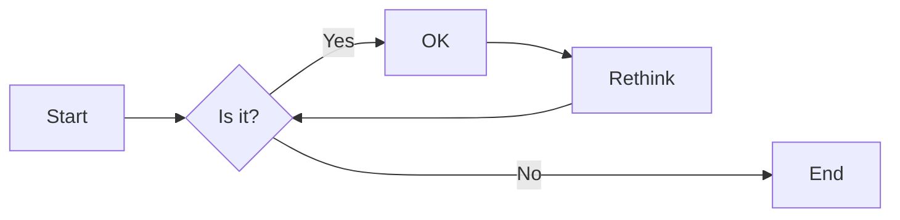
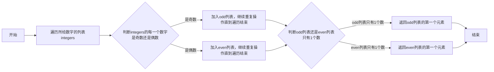

# 实验五 Python数据结构与数据模型

班级： 21计科3班

学号： B20210302303

姓名： 文凯

Github地址：<https://github.com/kaihuang614>

CodeWars地址：<https://www.codewars.com/users/kaihuang614>

---

## 实验目的

1. 学习Python数据结构的高级用法
2. 学习Python的数据模型

## 实验环境

1. Git
2. Python 3.10
3. VSCode
4. VSCode插件

## 实验内容和步骤

### 第一部分

在[Codewars网站](https://www.codewars.com)注册账号，完成下列Kata挑战：

---

#### 第一题：停止逆转我的单词

难度： 6kyu

编写一个函数，接收一个或多个单词的字符串，并返回相同的字符串，但所有5个或更多的字母单词都是相反的（就像这个Kata的名字一样）。传入的字符串将只由字母和空格组成。只有当出现一个以上的单词时，才会包括空格。
例如：

```python
spinWords( "Hey fellow warriors" ) => returns "Hey wollef sroirraw" 
spinWords( "This is a test") => returns "This is a test" 
spinWords( "This is another test" )=> returns "This is rehtona test"
```

代码提交地址：
<https://www.codewars.com/kata/5264d2b162488dc400000001>

提示：

- 利用str的split方法可以将字符串分为单词列表
例如：

```python
words = "hey fellow warrior".split()
# words should be ['hey', 'fellow', 'warrior']
```

- 利用列表推导将长度大于等于5的单词反转(利用切片word[::-1])
- 最后使用str的join方法连结列表中的单词。

---

#### 第二题： 发现离群的数(Find The Parity Outlier)

难度：6kyu

给你一个包含整数的数组（其长度至少为3，但可能非常大）。该数组要么完全由奇数组成，要么完全由偶数组成，除了一个整数N。请写一个方法，以该数组为参数，返回这个 "离群 "的N。

例如：

```python
[2, 4, 0, 100, 4, 11, 2602, 36]
# Should return: 11 (the only odd number)

[160, 3, 1719, 19, 11, 13, -21]
# Should return: 160 (the only even number)
```

代码提交地址：
<https://www.codewars.com/kata/5526fc09a1bbd946250002dc>

---

#### 第三题： 检测Pangram

难度：6kyu

pangram是一个至少包含每个字母一次的句子。例如，"The quick brown fox jumps over the lazy dog "这个句子就是一个pangram，因为它至少使用了一次字母A-Z（大小写不相关）。

给定一个字符串，检测它是否是一个pangram。如果是则返回`True`，如果不是则返回`False`。忽略数字和标点符号。
代码提交地址：
<https://www.codewars.com/kata/545cedaa9943f7fe7b000048>

---

#### 第四题： 数独解决方案验证

难度：6kyu

数独背景

数独是一种在 9x9 网格上进行的游戏。游戏的目标是用 1 到 9 的数字填充网格的所有单元格，以便每一列、每一行和九个 3x3 子网格（也称为块）中的都包含数字 1 到 9。更多信息请访问：<http://en.wikipedia.org/wiki/Sudoku>

编写一个函数接受一个代表数独板的二维数组，如果它是一个有效的解决方案则返回 true，否则返回 false。数独板的单元格也可能包含 0，这将代表空单元格。包含一个或多个零的棋盘被认为是无效的解决方案。棋盘总是 9 x 9 格，每个格只包含 0 到 9 之间的整数。

代码提交地址：
<https://www.codewars.com/kata/63d1bac72de941033dbf87ae>

---

#### 第五题： 疯狂的彩色三角形

难度： 2kyu

一个彩色的三角形是由一排颜色组成的，每一排都是红色、绿色或蓝色。连续的几行，每一行都比上一行少一种颜色，是通过考虑前一行中的两个相接触的颜色而产生的。如果这些颜色是相同的，那么新的一行就使用相同的颜色。如果它们不同，则在新的一行中使用缺失的颜色。这个过程一直持续到最后一行，只有一种颜色被生成。

例如：
```python
Colour here:            G G        B G        R G        B R
Becomes colour here:     G          R          B          G
```


一个更大的三角形例子：

```python
R R G B R G B B
 R B R G B R B
  G G B R G G
   G R G B G
    B B R R
     B G R
      R B
       G
```

你将得到三角形的第一行字符串，你的工作是返回最后的颜色，这将出现在最下面一行的字符串。在上面的例子中，你将得到 "RRGBRGBB"，你应该返回 "G"。
限制条件： 1 <= length(row) <= 10 ** 5
输入的字符串将只包含大写字母'B'、'G'或'R'。

例如：

```python
triangle('B') == 'B'
triangle('GB') == 'R'
triangle('RRR') == 'R'
triangle('RGBG') == 'B'
triangle('RBRGBRB') == 'G'
triangle('RBRGBRBGGRRRBGBBBGG') == 'G'
```

代码提交地址：
<https://www.codewars.com/kata/5a331ea7ee1aae8f24000175>

提示：请参考下面的链接，利用三进制的特点来进行计算。
<https://stackoverflow.com/questions/53585022/three-colors-triangles>

---

### 第二部分

使用Mermaid绘制程序流程图

安装VSCode插件：

- Markdown Preview Mermaid Support
- Mermaid Markdown Syntax Highlighting

使用Markdown语法绘制你的程序绘制程序流程图（至少一个），Markdown代码如下：


显示效果如下：



查看Mermaid流程图语法-->[点击这里](https://mermaid.js.org/syntax/flowchart.html)

使用Markdown编辑器（例如VScode）编写本次实验的实验报告，包括[实验过程与结果](#实验过程与结果)、[实验考查](#实验考查)和[实验总结](#实验总结)，并将其导出为 **PDF格式** 来提交。

## 实验过程与结果

请将实验过程与结果放在这里，包括：

- [第一部分 Codewars Kata挑战](#第一部分)

第一题： 停止逆转我的单词（Stop gninnipS My sdroW）

```python
def spin_words(sentence):
    tmp = sentence.split(' ') #将所给字符串以空格为分割符分割单词保存到列表
    res = [word[::-1] if len(word) >= 5 else word for word in tmp] #反转长度大于等于5的单词
    return ' '.join(res) #每连接1个单词加一个空格
```

第二题： 发现离群的数（Find The Parity Outlier）

```python
def find_outlier(integers):
    odd = []    #odd列表保存integers中所有奇数
    even = []   #even列表保存integers中所有偶数
    
    for number in integers:
        if number % 2 == 0:     #若当前数为偶数，则加入even
            even.append(number)
        else:                   #否则当前数为奇数，加入odd
            odd.append(number)
            
    if len(odd) == 1:   #若odd的长度为1，说明离群数是奇数
        return odd[0]
    else:               #否则even的长度为1，说明离群数是偶数
        return even[0]
```

第三题： 检测Pangram（Detect Pangram）

```python
def is_pangram(s):
    lower_s = s.lower() #因为不区分大小写所以将s转成全部小写
    str = 'abcdefghijklmnopqrstuvwxyz' #26个字母的字符串
    
    for char in str: #遍历str
        if char not in lower_s: #如果存在字母不在lower_s里面，说明s不是pangram，返回False
            return False
        
    return True #26个字母都在lower_s里面，说明s是pangram，返回True
```

第四题： 数独解决方案验证（Sudoku board validator）

```python
def validate_sudoku(board):
    rows = [set() for _ in range(9)]  # 存储每一行中出现的数字
    cols = [set() for _ in range(9)]  # 存储每一列中出现的数字
    boxes = [set() for _ in range(9)]  # 存储每个九宫格中出现的数字

    for i in range(9):
        for j in range(9):
            num = board[i][j]
            if num == 0:
                return False  # 数独板中包含 0，直接返回 False 表示无效

            box_index = (i // 3) * 3 + j // 3  # 计算当前单元格所属的九宫格索引

            if num in rows[i] or num in cols[j] or num in boxes[box_index]:
                return False  # 数字在当前行、当前列或当前九宫格中出现重复，返回 False 表示无效

            rows[i].add(num)
            cols[j].add(num)
            boxes[box_index].add(num)

    return True  # 数独板有效，返回 True
```

第五题： 疯狂的彩色三角形（Insane Coloured Triangles）

```python
COLOR = {'GG':'G', 'BB':'B', 'RR':'R', 'BR':'G', 'BG':'R', 'GB':'R', 'GR':'B', 'RG':'B', 'RB':'G'}

# 根据颜色对照表 COLOR 返回给定颜色的结果
def get_colour(colour):
    return COLOR[colour]
    
# 计算最大的幂次，使得 3^p + 1 <= length_row
def get_power(length_row):
    p = 1
    while length_row >= 3**(p)+1:
        if length_row == 3**(p)+1:
            return 3**(p)+1
        p += 1
    return 3**(p-1)+1
   
def triangle(row):
    # 如果行的长度小于 3，则直接返回行本身（如果长度为 1）或者行的首尾颜色的组合结果
    if len(row) < 3:
        return row if len(row) is 1 else get_colour(row[0]+row[-1]) 
        
    # 获取最大的幂次
    row_p = get_power(len(row))
    
    # 如果行的长度等于最大幂次，则返回行的首尾颜色的组合结果
    if len(row) == row_p:
        return get_colour(row[0]+row[row_p-1]) 
    
    # 构建新的行，通过将每个相邻的颜色组合进行转换
    new_row = ''
    for i in range(len(row)-row_p+1):
        new_row += get_colour(row[i]+row[row_p+i-1])
    
    # 递归调用 triangle 函数，对新的行进行处理
    return triangle(new_row)
```

- [第二部分 使用Mermaid绘制程序流程图](#第二部分)

第一题： 停止逆转我的单词（Stop gninnipS My sdroW）


## 实验考查

请使用自己的语言并使用尽量简短代码示例回答下面的问题，这些问题将在实验检查时用于提问和答辩以及实际的操作。

1. 集合（set）类型有什么特点？它和列表（list）类型有什么区别？

```
集合（set）类型是Python中的一种无序、可变的数据类型。它有以下几个特点：

唯一性：集合中的元素是唯一的，重复的元素会被自动去重。
无序性：集合中的元素没有固定的顺序，无法通过索引访问。
可变性：集合是可变的，可以添加、删除和修改元素。
与列表（list）类型相比，集合有以下区别：

唯一性：列表中的元素可以重复，而集合中的元素不重复。
有序性：列表中的元素有顺序，可以通过索引访问和操作，而集合中的元素没有固定的顺序。
可变性：列表是可变的，可以随意修改元素的值，而集合也是可变的，但是不能通过索引直接修改元素的值，需要使用特定的方法。
下面是简短的代码示例来说明集合和列表的区别：

# 列表示例
my_list = [1, 2, 3, 3, 4, 5, 5]
print(my_list)  # 输出: [1, 2, 3, 3, 4, 5, 5]

# 集合示例
my_set = {1, 2, 3, 3, 4, 5, 5}
print(my_set)  # 输出: {1, 2, 3, 4, 5}

# 修改列表元素
my_list[0] = 0
print(my_list)  # 输出: [0, 2, 3, 3, 4, 5, 5]

# 修改集合元素（不支持通过索引直接修改）
my_set.add(6)
print(my_set)  # 输出: {1, 2, 3, 4, 5, 6}
在上面的示例中，列表允许重复元素，可以通过索引修改元素的值，而集合自动去重元素，无法通过索引修改元素的值。
```

2. 集合（set）类型主要有那些操作？

```
集合（set）类型在Python中支持许多常用的操作。以下是一些主要的集合操作，以及简短的代码示例：

1、创建集合：
my_set = {1, 2, 3}  # 使用花括号创建集合

2、添加元素：
my_set.add(4)  # 添加单个元素
my_set.update([5, 6])  # 添加多个元素

3、删除元素：
my_set.remove(3)  # 删除指定元素，如果元素不存在会引发KeyError
my_set.discard(4)  # 删除指定元素，如果元素不存在不会引发错误
my_set.pop()  # 随机删除并返回一个元素

4、集合运算：
并集：
set1 = {1, 2, 3}
set2 = {3, 4, 5}
union_set = set1.union(set2)  # 或使用符号 | 进行并集操作

交集：
set1 = {1, 2, 3}
set2 = {3, 4, 5}
intersection_set = set1.intersection(set2)  # 或使用符号 & 进行交集操作

差集：
set1 = {1, 2, 3}
set2 = {3, 4, 5}
difference_set = set1.difference(set2)  # 或使用符号 - 进行差集操作

对称差集：
set1 = {1, 2, 3}
set2 = {3, 4, 5}
symmetric_difference_set = set1.symmetric_difference(set2)  # 或使用符号 ^ 进行对称差集操作

5、判断元素是否存在：
my_set = {1, 2, 3}
print(1 in my_set)  # 输出: True
print(4 not in my_set)  # 输出: True
```

3. 使用`*`操作符作用到列表上会产生什么效果？为什么不能使用`*`操作符作用到嵌套的列表上？使用简单的代码示例说明。

```
在Python中，*操作符用于重复一个序列（例如列表）的元素。当*操作符作用于列表时，它会将列表中的元素重复指定的次数，生成一个新的列表。

以下是使用*操作符作用于列表的示例代码：

my_list = [1, 2, 3]
repeated_list = my_list * 3
print(repeated_list)  # 输出: [1, 2, 3, 1, 2, 3, 1, 2, 3]

在上面的示例中，my_list * 3将列表my_list中的元素重复3次，生成了一个新的列表repeated_list。

然而，*操作符不能直接用于嵌套的列表上。这是因为*操作符只是将原始列表的引用复制了多次，而不是创建新的嵌套列表。

以下是使用*操作符作用于嵌套列表的示例代码和解释：

nested_list = [[1, 2], [3, 4]]
repeated_nested_list = nested_list * 3
print(repeated_nested_list)  # 输出: [[1, 2], [3, 4], [1, 2], [3, 4], [1, 2], [3, 4]]

nested_list[0][0] = 5
print(repeated_nested_list)  # 输出: [[5, 2], [3, 4], [5, 2]
[3, 4], [5, 2], [3, 4]]

在上面的示例中，nested_list * 3生成了一个新的列表repeated_nested_list，但是repeated_nested_list中的子列表实际上是指向原始列表nested_list中相同位置的子列表。因此，当修改原始列表中的子列表时，repeated_nested_list中的相应子列表也会被修改，因为它们引用的是同一个对象。

为了创建新的独立的嵌套列表，我们需要使用其他方法，例如列表推导式或循环来创建新的列表对象。
```

4. 总结列表,集合，字典的解析的使用方法。使用简单的代码示例说明。

```
列表、集合和字典解析是在Python中创建和构建这些数据结构的简洁方式。它们允许我们使用一行代码来生成新的列表、集合或字典，而不需要显式的循环和条件语句。

以下是列表、集合和字典解析的使用方法及简单的代码示例：

1、列表解析：

列表解析允许我们根据一个可迭代对象（如列表、元组或范围）创建一个新的列表。

# 生成一个包含1到5的平方的列表
squared_list = [x**2 for x in range(1, 6)]
print(squared_list)  # 输出: [1, 4, 9, 16, 25]

2、集合解析：

集合解析允许我们根据一个可迭代对象创建一个新的集合，去除重复的元素。

# 生成一个包含1到5的平方的集合
squared_set = {x**2 for x in range(1, 6)}
print(squared_set)  # 输出: {1, 4, 9, 16, 25}

3、字典解析：

字典解析允许我们根据一个可迭代对象创建一个新的字典，可以指定键和值的表达式。

# 生成一个包含1到5的平方的字典，键为数字，值为数字的平方
squared_dict = {x: x**2 for x in range(1, 6)}
print(squared_dict)  # 输出: {1: 1, 2: 4, 3: 9, 4: 16, 5: 25}

在上述示例中，通过使用解析，我们可以简洁地创建新的列表、集合和字典。解析可以包含条件语句和嵌套循环，以便更灵活地生成所需的数据结构。

需要注意的是，解析并不适用于所有情况。当数据的生成逻辑变得复杂或需要进行大量的计算时，可能会更适合使用传统的循环和条件语句来构建数据结构。
```

## 实验总结

总结一下这次实验你学习和使用到的知识，例如：编程工具的使用、数据结构、程序语言的语法、算法、编程技巧、编程思想。

完成实验5，我的收获如下：

- 这次实验学习了python集合类型的特点，了解了集合类型主要有哪些操作，以及它和列表类型的区别。
- 总结了列表,集合，字典的解析的使用方法。
- 做了codewars上面不同难度的题目，这对我熟悉python的基本语法很有帮助。
