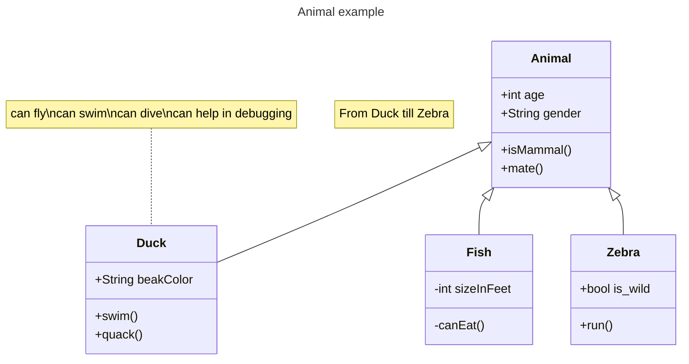
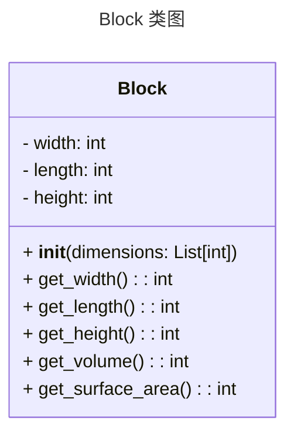

# 实验七 Python面向对象编程

班级： 21计科3班

学号： B20210302303

姓名： 文凯

Github地址：<https://github.com/kaihuang614>

CodeWars地址：<https://www.codewars.com/users/kaihuang614>

---

## 实验目的

1. 学习Python类和继承的基础知识
2. 学习namedtuple和DataClass的使用

## 实验环境

1. Git
2. Python 3.10
3. VSCode
4. VSCode插件

## 实验内容和步骤

### 第一部分

Python面向对象编程

完成教材《Python编程从入门到实践》下列章节的练习：

- 第9章 类

---

### 第二部分

在[Codewars网站](https://www.codewars.com)注册账号，完成下列Kata挑战：

---

#### 第一题：面向对象的海盗

难度： 8kyu

啊哈，伙计!

你是一个小海盗团的首领。而且你有一个计划。在OOP的帮助下，你希望建立一个相当有效的系统来识别船上有大量战利品的船只。
对你来说，不幸的是，现在的人很重，那么你怎么知道一艘船上装的是黄金而不是人呢？

你首先要写一个通用的船舶类。

```python
class Ship:
    def __init__(self, draft, crew):
        self.draft = draft
        self.crew = crew
```

每当你的间谍看到一艘新船进入码头，他们将根据观察结果创建一个新的船舶对象。

- `draft`吃水 - 根据船在水中的高度来估计它的重量
- `crew`船员 - 船上船员的数量

`Titanic = Ship(15, 10)`

任务

你可以访问船舶的 "draft(吃水) "和 "crew(船员)"。"draft(吃水) "是船的总重量，"船员 "是船上的人数。
每个船员都会给船的吃水增加1.5个单位。如果除去船员的重量后，吃水仍然超过20，那么这艘船就值得掠夺。任何有这么重的船一定有很多战利品!
添加方法
`is_worth_it`
来决定这艘船是否值得掠夺。

例如：

```python
Titanic.is_worth_it()
False
```

祝你好运，愿你能找到金子!

代码提交地址：
<https://www.codewars.com/kata/54fe05c4762e2e3047000add>

---

#### 第二题： 搭建积木

难度：7kyu

写一个创建Block的类（Duh.）
构造函数应该接受一个数组作为参数，这个数组将包含3个整数，其形式为`[width, length, height]`，Block应该由这些整数创建。

定义这些方法:

- `get_width()` return the width of the `Block`
- `get_length()` return the length of the `Block`
- `get_height()` return the height of the `Block`
- `get_volume()` return the volume of the `Block`
- `get_surface_area()` return the surface area of the `Block`

例子：

```python
b = Block([2,4,6]) # create a `Block` object with a width of `2` a length of `4` and a height of `6`
b.get_width() # return 2    
b.get_length() # return 4
b.get_height() # return 6
b.get_volume() # return 48
b.get_surface_area() # return 88
```

注意： 不需要检查错误的参数。

代码提交地址：
<https://www.codewars.com/kata/55b75fcf67e558d3750000a3>

---

#### 第三题： 分页助手

难度：5kyu

在这个练习中，你将加强对分页的掌握。你将完成PaginationHelper类，这是一个实用类，有助于查询与数组有关的分页信息。
该类被设计成接收一个值的数组和一个整数，表示每页允许多少个项目。集合/数组中包含的值的类型并不相关。

下面是一些关于如何使用这个类的例子：

```python
helper = PaginationHelper(['a','b','c','d','e','f'], 4)
helper.page_count() # should == 2
helper.item_count() # should == 6
helper.page_item_count(0)  # should == 4
helper.page_item_count(1) # last page - should == 2
helper.page_item_count(2) # should == -1 since the page is invalid

# page_index takes an item index and returns the page that it belongs on
helper.page_index(5) # should == 1 (zero based index)
helper.page_index(2) # should == 0
helper.page_index(20) # should == -1
helper.page_index(-10) # should == -1 because negative indexes are invalid
```

代码提交地址：
<https://www.codewars.com/kata/515bb423de843ea99400000a>


---

#### 第四题： 向量（Vector）类

难度： 5kyu

创建一个支持加法、减法、点积和向量长度的向量（Vector）类。

举例来说：

```python
a = Vector([1, 2, 3])
b = Vector([3, 4, 5])
c = Vector([5, 6, 7, 8])

a.add(b)      # should return a new Vector([4, 6, 8])
a.subtract(b) # should return a new Vector([-2, -2, -2])
a.dot(b)      # should return 1*3 + 2*4 + 3*5 = 26
a.norm()      # should return sqrt(1^2 + 2^2 + 3^2) = sqrt(14)
a.add(c)      # raises an exception
```

如果你试图对两个不同长度的向量进行加减或点缀，你必须抛出一个错误。
向量类还应该提供：

- 一个 `__str__` 方法，这样 `str(a) === '(1,2,3)'` 
- 一个equals方法，用来检查两个具有相同成分的向量是否相等。

注意：测试案例将利用用户提供的equals方法。

代码提交地址：
<https://www.codewars.com/kata/526dad7f8c0eb5c4640000a4>

---

#### 第五题： Codewars风格的等级系统

难度： 4kyu

编写一个名为User的类，用于计算用户在类似于Codewars使用的排名系统中的进步量。

业务规则：

- 一个用户从等级-8开始，可以一直进步到8。
- 没有0（零）等级。在-1之后的下一个等级是1。
- 用户将完成活动。这些活动也有等级。
- 每当用户完成一个有等级的活动，用户的等级进度就会根据活动的等级进行更新。
- 完成活动获得的进度是相对于用户当前的等级与活动的等级而言的。
- 用户的等级进度从零开始，每当进度达到100时，用户的等级就会升级到下一个等级。
- 在上一等级时获得的任何剩余进度都将被应用于下一等级的进度（我们不会丢弃任何进度）。例外的情况是，如果没有其他等级的进展（一旦你达到8级，就没有更多的进展了）。
- 一个用户不能超过8级。
- 唯一可接受的等级值范围是-8,-7,-6,-5,-4,-3,-2,-1,1,2,3,4,5,6,7,8。任何其他的值都应该引起错误。

逻辑案例：

- 如果一个排名为-8的用户完成了一个排名为-7的活动，他们将获得10的进度。
- 如果一个排名为-8的用户完成了排名为-6的活动，他们将获得40的进展。
- 如果一个排名为-8的用户完成了排名为-5的活动，他们将获得90的进展。
- 如果一个排名-8的用户完成了排名-4的活动，他们将获得160个进度，从而使该用户升级到排名-7，并获得60个进度以获得下一个排名。
- 如果一个等级为-1的用户完成了一个等级为1的活动，他们将获得10个进度（记住，零等级会被忽略）。

代码案例：

```python
user = User()
user.rank # => -8
user.progress # => 0
user.inc_progress(-7)
user.progress # => 10
user.inc_progress(-5) # will add 90 progress
user.progress # => 0 # progress is now zero
user.rank # => -7 # rank was upgraded to -7
```

代码提交地址：
<https://www.codewars.com/kata/51fda2d95d6efda45e00004e>

---

### 第三部分

使用Mermaid绘制程序的**类图**

安装VSCode插件：

- Markdown Preview Mermaid Support
- Mermaid Markdown Syntax Highlighting

使用Markdown语法绘制你的程序绘制程序类图（至少一个），Markdown代码如下：


显示效果如下：



查看Mermaid类图的语法-->[点击这里](https://mermaid.js.org/syntax/classDiagram.html)

使用Markdown编辑器（例如VScode）编写本次实验的实验报告，包括[实验过程与结果](#实验过程与结果)、[实验考查](#实验考查)和[实验总结](#实验总结)，并将其导出为 **PDF格式** 来提交。

## 实验过程与结果

请将实验过程与结果放在这里，包括：

- [第一部分 Python面向对象编程](#第一部分)
- [第二部分 Codewars Kata挑战](#第二部分)

第一题：面向对象的海盗

```python
class Ship:
    def __init__(self, draft, crew):
        self.draft = draft
        self.crew = crew
        
    def is_worth_it(self):
        if self.draft - (self.crew * 1.5) > 20:
            return True
        else:
            return False
```

第二题： 搭建积木

```python
class Block:
    def __init__(self, dimensions):
        # 初始化块的宽度、长度和高度属性
        self.width = dimensions[0]
        self.length = dimensions[1]
        self.height = dimensions[2]
        
    def get_width(self):
        # 返回块的宽度
        return self.width
    
    def get_length(self):
        # 返回块的长度
        return self.length
    
    def get_height(self):
        # 返回块的高度
        return self.height
    
    def get_volume(self):
        # 计算并返回块的体积
        return self.width * self.length * self.height
    
    def get_surface_area(self):
        # 计算并返回块的表面积
        return 2 * (self.width * self.length + self.width * self.height + self.length * self.height)
```

第三题： 分页助手

```python
class PaginationHelper:
    def __init__(self, collection, items_per_page):
        # 初始化 PaginationHelper 类
        self.collection = collection
        self.items_per_page = items_per_page

    def item_count(self):
        # 返回集合/数组中的项目总数
        return len(self.collection)

    def page_count(self):
        # 返回分页后的总页数
        return (len(self.collection) + self.items_per_page - 1) // self.items_per_page

    def page_item_count(self, page_index):
        # 返回指定页的项目数量
        if page_index < 0 or page_index >= self.page_count():
            return -1
        
        if page_index == self.page_count() - 1:
            return len(self.collection) % self.items_per_page or self.items_per_page
        else:
            return self.items_per_page

    def page_index(self, item_index):
        # 返回包含指定项目索引的页索引
        if item_index < 0 or item_index >= len(self.collection):
            return -1
        
        return item_index // self.items_per_page
```

第四题： 向量（Vector）类

```python
import math

class Vector:
    def __init__(self, components):
        # 初始化 Vector 类
        self.components = components

    def __str__(self):
        # 返回向量的字符串表示形式
        return '(' + ','.join(str(x) for x in self.components) + ')'

    def equals(self, other):
        # 检查两个向量是否相等
        return self.components == other.components

    def add(self, other):
        # 对向量进行加法运算
        if len(self.components) != len(other.components):
            raise ValueError("Cannot add vectors of different lengths")

        result = [x + y for x, y in zip(self.components, other.components)]
        return Vector(result)

    def subtract(self, other):
        # 对向量进行减法运算
        if len(self.components) != len(other.components):
            raise ValueError("Cannot subtract vectors of different lengths")

        result = [x - y for x, y in zip(self.components, other.components)]
        return Vector(result)

    def dot(self, other):
        # 计算向量的点积
        if len(self.components) != len(other.components):
            raise ValueError("Cannot calculate dot product of vectors of different lengths")

        result = sum(x * y for x, y in zip(self.components, other.components))
        return result

    def norm(self):
        # 计算向量的长度
        result = math.sqrt(sum(x ** 2 for x in self.components))
        return result
```

第五题： Codewars风格的等级系统

```python
class User:
    rank_vector = [i for i in range(-8, 9) if i != 0]  # 可接受的等级范围

    def __init__(self):
        self.rank = -8  # 初始等级为-8
        self.progress = 0  # 初始进度为0

    def inc_progress(self, kata):
        if kata not in self.rank_vector:
            raise ValueError("不在指定的等级范围内")
        
        if self.rank == 8:
            progress_meter = 0  # 达到最高等级时，进度为0
        elif self.rank_vector.index(kata) == self.rank_vector.index(self.rank):
            progress_meter = self.progress + 3  # 完成与当前等级相同的活动，进度加3
        elif self.rank_vector.index(kata) == self.rank_vector.index(self.rank) - 1:
            progress_meter = self.progress + 1  # 完成比当前等级低一级的活动，进度加1
        elif self.rank_vector.index(kata) <= self.rank_vector.index(self.rank) - 2:
            progress_meter = self.progress  # 完成比当前等级低两级或更低的活动，进度不变
        elif self.rank == -1 and kata == 1:
            progress_meter = self.progress + 10  # 特殊情况：完成-1等级和1等级之间的活动，进度加10
        else:
            difference = abs(self.rank_vector.index(kata) - self.rank_vector.index(self.rank))
            progress_meter = self.progress + 10 * difference ** 2  # 根据等级差异计算进度
        
        progress_index = divmod(progress_meter, 100)
        self.progress = progress_index[1]  # 更新进度
        self.rank = self.__update_rank__(progress_index[0])  # 更新等级
        
        if self.rank == 8:
            self.progress = 0  # 达到最高等级时，进度重置为0
        
        return self.progress

    def __update_rank__(self, level=1):
        if self.rank == 8:
            return self.rank  # 已达到最高等级，不再更新
        elif self.rank_vector.index(self.rank) + level > self.rank_vector.index(8):
            self.rank = 8  # 更新等级为最高等级
        else:
            self.rank = self.rank_vector[self.rank_vector.index(self.rank) + level]  # 更新等级为下一个等级
        
        return self.rank
```

- [第三部分 使用Mermaid绘制程序流程图](#第三部分)

第二题： 搭建积木



## 实验考查

请使用自己的语言并使用尽量简短代码示例回答下面的问题，这些问题将在实验检查时用于提问和答辩以及实际的操作。

1. Python的类中__init__方法起什么作用？

```
在Python中，__init__方法是一个特殊的方法，它在创建类的实例时被调用。它的主要作用是初始化类的实例，并可用于执行任何必要的设置或准备工作。

下面是一个简短的代码示例，说明__init__方法的作用：
class MyClass:
    def __init__(self, name):
        self.name = name
        print("Initializing MyClass")

    def say_hello(self):
        print(f"Hello, {self.name}!")

# 创建类的实例
obj = MyClass("Alice")

# 调用实例方法
obj.say_hello()

在上面的示例中，MyClass类有一个__init__方法，它接受一个name参数并将其存储为实例变量self.name。在创建MyClass的实例时，__init__方法被自动调用，并输出"Initializing MyClass"。然后，我们可以通过调用实例方法say_hello打印出"Hello, Alice!"，其中self.name被使用。

因此，可以看出__init__方法在类的实例化过程中起到了初始化实例的作用，可以用于设置实例变量或执行其他必要的操作。
```

2. Python语言中如何继承父类和改写（override）父类的方法。

```
在Python语言中，可以通过创建一个子类来继承父类，并且可以在子类中对父类的方法进行改写（override）。

下面是一个简短的代码示例，演示如何继承父类和改写父类的方法：
class ParentClass:
    def my_method(self):
        print("This is the parent class method.")

class ChildClass(ParentClass):
    def my_method(self):
        print("This is the child class method.")

# 创建父类实例并调用方法
parent_obj = ParentClass()
parent_obj.my_method()  # 输出："This is the parent class method."

# 创建子类实例并调用方法
child_obj = ChildClass()
child_obj.my_method()  # 输出："This is the child class method."

在上面的示例中，我们定义了一个父类ParentClass，其中包含一个名为my_method的方法。然后，我们创建了一个子类ChildClass，它继承了父类ParentClass。

在子类中，我们定义了一个与父类同名的方法my_method，这样就改写（override）了父类的方法。在子类的方法中，我们输出了不同的消息。

当我们实例化父类或子类的对象并调用my_method方法时，会根据对象的类型决定调用父类的方法还是子类的方法。在上述示例中，parent_obj.my_method()调用的是父类的方法，输出"This is the parent class method."，而child_obj.my_method()调用的是子类的方法，输出"This is the child class method."。

通过继承和改写父类的方法，我们可以在子类中根据需要修改或扩展父类的行为。
```

3. Python类有那些特殊的方法？它们的作用是什么？请举三个例子并编写简单的代码说明。

```
在Python中，类可以定义一些特殊的方法，也称为魔术方法或双下方法（dunder methods），它们以双下划线（__）开头和结尾。这些特殊方法用于实现类的特定行为和功能。以下是三个常用的特殊方法和它们的作用：

1、__init__: 这是类的构造方法，在创建类的实例时被调用。它用于初始化实例的状态和执行必要的设置。例如：
class MyClass:
    def __init__(self, name):
        self.name = name

obj = MyClass("Alice")
print(obj.name)  # 输出："Alice"

在上面的示例中，__init__方法接受一个name参数，并将其存储为实例变量self.name。

2、__str__: 这个方法返回一个可读性好的字符串表示类的实例。它通常用于打印对象或在字符串上下文中使用。例如：
class Point:
    def __init__(self, x, y):
        self.x = x
        self.y = y

    def __str__(self):
        return f"Point({self.x}, {self.y})"

p = Point(2, 3)
print(p)  # 输出："Point(2, 3)"

在上面的示例中，__str__方法返回一个形如"Point(x, y)"的字符串，表示Point类的实例。

3、__len__: 这个方法返回类的实例的长度或大小。它通常用于支持内置的len()函数或对类进行迭代操作。例如：
class MyList:
    def __init__(self, items):
        self.items = items

    def __len__(self):
        return len(self.items)

my_list = MyList([1, 2, 3, 4, 5])
print(len(my_list))  # 输出：5

在上面的示例中，__len__方法返回self.items的长度，以支持对MyList类实例的长度操作。

这些只是Python类中一些常用的特殊方法的示例。通过实现这些特殊方法，我们可以自定义类的行为，使其更加灵活和适应特定的需求。
```

## 实验总结

总结一下这次实验你学习和使用到的知识，例如：编程工具的使用、数据结构、程序语言的语法、算法、编程技巧、编程思想。

完成实验7，我的收获如下：

- 这次实验我学习了Python类和继承的基础知识
- 学习了namedtuple和DataClass的使用
- 做了codewars上面不同难度的题目，这对我熟悉python的基本语法很有帮助。