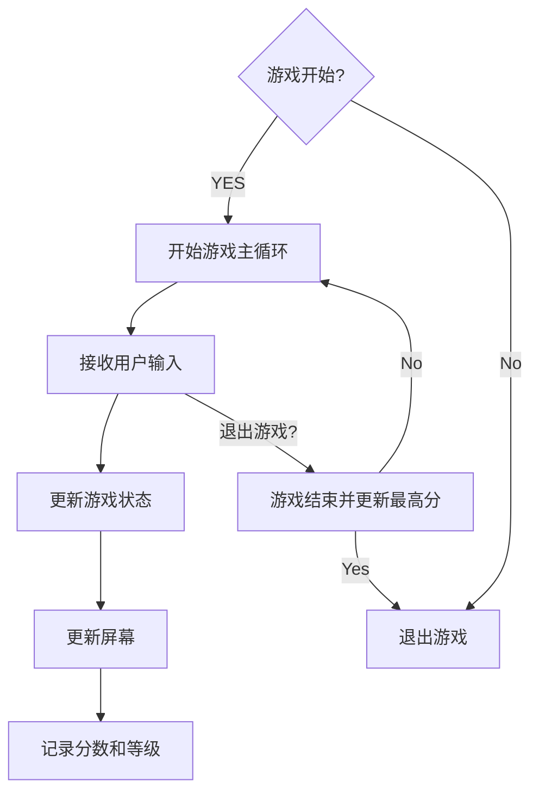
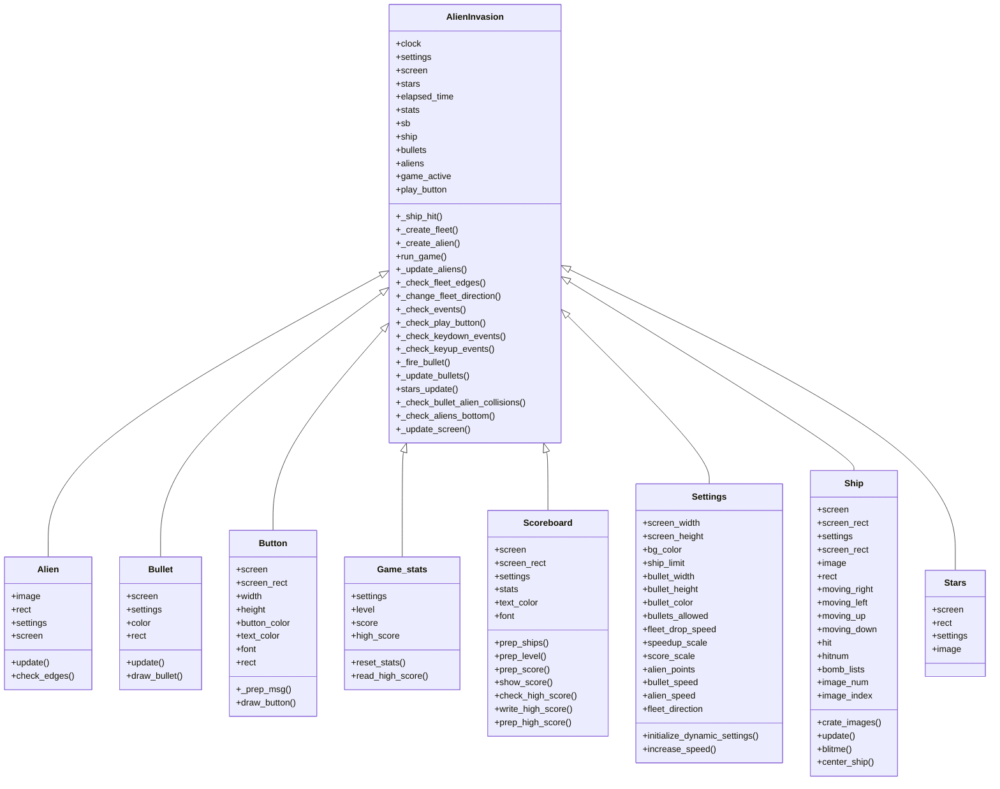

# 《Python程序设计基础》程序设计作品说明书

题目： 外星人入侵游戏

学院： 21计科03

姓名： 文凯

学号： B20210302303

指导教师： 周景

起止日期：2023.11.10-2023.12.10

## 摘要

_介绍本次设计完成的项目的概述，本文的主要内容，总结你主要完成的工作以及关键词。_
本次设计完成的项目是名为"外星人大战"（Alien Invasion）的游戏。该游戏基于Pygame库开发，玩家需要控制一艘飞船与入侵地球的外星人展开激烈的战斗。

游戏的主要内容包括玩家飞船的移动和射击操作，以及外星人的生成、移动和射击行为。玩家需要通过操控飞船来尽可能地消灭它们，并获得高分。

在项目中，我主要完成了以下工作：

设计了游戏的整体架构和流程，包括游戏窗口的创建、游戏角色（飞船和外星人）的初始化、游戏事件的处理等。
实现了玩家飞船的移动控制逻辑，包括响应键盘事件来控制飞船的左右移动。
设计了外星人的生成逻辑和移动模式，使它们能够随机生成并朝着玩家飞船移动。
实现了飞船和外星人的射击行为，包括发射子弹和检测碰撞等。
设计了游戏的界面和计分系统，使玩家能够清晰地了解当前的游戏状态和得分情况。
关键词：外星人大战，Pygame库，飞船控制，外星人生成，射击行为，游戏界面，计分系统。
关键词：

## 第1章 需求分析

_本章的内容主要包括系统的需求分析，系统主要需要实现的功能有哪些，可以帮助用户解决哪些问题等等。_

1. 游戏界面：

游戏需要有一个可视化的界面，以显示游戏场景和相关元素，如飞船、外星人、子弹等。
界面应具有吸引人的图形和动画效果，以提升游戏体验。

2. 飞船控制：

玩家需要能够通过键盘或其他输入设备来控制飞船的移动。
飞船的移动应该具有平滑的动画效果，并能够在屏幕边界内自由移动。
3. 外星人生成：

游戏需要随机生成外星人，并将它们放置在屏幕上的不同位置。
外星人的生成应该具有一定的难度和挑战性，以增加游戏的乐趣。

4. 射击行为：

玩家需要能够通过按键或其他方式发射子弹来攻击外星人。
子弹应该具有一定的速度和射程，能够击中目标并造成伤害。
5. 碰撞检测：

游戏需要实现碰撞检测机制，以判断飞船的子弹是否击中了外星人，或者外星人是否撞击了飞船。
在发生碰撞时，应有相应的效果和动画，如爆炸、得分增加等。

6. 游戏进程和计分：

游戏需要记录玩家的得分，并显示在界面上。
当玩家成功击败外星人或达到一定条件时，游戏应该给予相应的奖励或进入下一关卡。

## 第2章 分析与设计

_本章的内容主要包括系统的设计，例如：系统架构、系统流程、系统模块、数据库的设计，以及关键的实现，例如：使用的数据结果、算法。_

1. 游戏场景和元素：

分析：游戏需要一个游戏窗口来显示游戏场景和相关元素，如飞船、外星人、子弹等。窗口的大小和背景可以根据需求进行设计。

设计：使用Pygame库创建游戏窗口，设置窗口大小和背景，并确保游戏元素能够正确显示在窗口中。

2. 飞船控制：

分析：玩家需要能够通过键盘或其他输入设备来控制飞船的移动。飞船的移动应该具有平滑的动画效果，并能够在屏幕边界内自由移动。

设计：监听键盘事件，根据按键的输入来控制飞船的移动。并限制其在屏幕边界内移动。

3. 外星人生成：

分析：游戏需要随机生成外星人，并将它们放置在屏幕上的不同位置。外星人的生成应具有一定的难度和挑战性。

设计：设计外星人的外观和属性，在屏幕上随机生成外星人，确保它们不会重叠，并根据游戏难度逐渐增加外星人的数量和移动速度。

4. 射击行为：

分析：玩家需要能够通过按键或其他方式发射子弹来攻击外星人。子弹应该具有一定的速度和射程，能够击中目标并造成伤害。

设计：监听键盘事件，根据按键的输入来发射子弹。设计子弹的外观和属性，并控制子弹的移动和碰撞检测，以判断是否击中外星人。

5. 碰撞检测：

分析：游戏需要实现碰撞检测机制，以判断飞船的子弹是否击中了外星人，或者外星人是否撞击了飞船。在发生碰撞时，应有相应的效果和动画，如爆炸、得分增加等。

设计：设计碰撞检测算法，检测飞船的子弹和外星人之间的碰撞，并触发相应的动画效果和得分增加。

6. 游戏进程和计分：

分析：游戏需要记录玩家的得分，并显示在界面上。当玩家成功击败外星人或达到一定条件时，游戏应给予相应的奖励或进入下一关卡。

设计：设计计分系统，记录玩家的得分，并在界面上显示。根据游戏规则和条件，判断玩家的游戏进程，如击败特定数量的外星人或存活时间等，以决定是否给予奖励或进入下一关卡。

#### 2.2 程序流程



#### 2.3 系统模块



### 2.4 数据存储结构

由于本项目为简单的单机游戏，不涉及数据库存储，得分统计和最高分采用本地文件进行保存和读取。

### 2.5 数据访问

通过io流读取文件内容。

## 第3章 软件测试

### 3.1 单元测试

#### 3.1.1 飞船（Ship）对象测试

##### 测试用例 1：初始化飞船对象

```python
def test_ship_init():
    ai_settings = Settings()
    screen = pygame.display.set_mode((ai_settings.screen_width, ai_settings.screen_height))
    ship = Ship(ai_settings, screen)
    assert ship.rect.centerx == screen.get_rect().centerx
    assert ship.rect.bottom == screen.get_rect().bottom
    assert ship.moving_right == False
    assert ship.moving_left == False
```

##### 测试用例 2：更新飞船位置

```python
def test_ship_update():
    ai_settings = Settings()
    screen = pygame.display.set_mode((ai_settings.screen_width, ai_settings.screen_height))
    ship = Ship(ai_settings, screen)
    initial_centerx = ship.rect.centerx
    ship.moving_right = True
    ship.update()
    assert ship.rect.centerx == initial_centerx + ai_settings.ship_speed_factor
```

#### 3.1.2 外星人（Alien）对象测试

##### 测试用例 3：初始化外星人对象

```python
def test_alien_init():
    ai_settings = Settings()
    screen = pygame.display.set_mode((ai_settings.screen_width, ai_settings.screen_height))
    alien = Alien(ai_settings, screen)
    assert alien.rect.x == alien.rect.width
    assert alien.rect.y == alien.rect.height
    assert alien.x == float(alien.rect.x)
    assert alien.check_edges() == False
```

##### 测试用例 4：更新外星人位置

```python
def test_alien_update():
    ai_settings = Settings()
    screen = pygame.display.set_mode((ai_settings.screen_width, ai_settings.screen_height))
    alien = Alien(ai_settings, screen)
    initial_x = alien.x
    alien.update()
    assert alien.x == initial_x + (ai_settings.alien_speed_factor * ai_settings.fleet_direction)
```

#### 3.1.3 子弹（Bullet）对象测试

##### 测试用例 5：初始化子弹对象

```python
def test_bullet_init():
    ai_settings = Settings()
    screen = pygame.display.set_mode((ai_settings.screen_width, ai_settings.screen_height))
    ship = Ship(ai_settings, screen)
    bullet = Bullet(ai_settings, screen, ship)
    assert bullet.rect.centerx == ship.rect.centerx
    assert bullet.rect.top == ship.rect.top
    assert bullet.y == float(bullet.rect.y)
```

##### 测试用例 6：更新子弹位置

```python
def test_bullet_update():
    ai_settings = Settings()
    screen = pygame.display.set_mode((ai_settings.screen_width, ai_settings.screen_height))
    ship = Ship(ai_settings, screen)
    bullet = Bullet(ai_settings, screen, ship)
    initial_y = bullet.y
    bullet.update()
    assert bullet.y == initial_y - ai_settings.bullet_speed_factor
```

### 3.2 功能测试

##### 测试用例 7：检测外星人是否生成

```python
def test_create_aliens():
    ai_settings = Settings()
    screen = pygame.display.set_mode((ai_settings.screen_width, ai_settings.screen_height))
    ship = Ship(ai_settings, screen)
    aliens = Group()
    create_fleet(ai_settings, screen, ship, aliens)
    assert len(aliens) > 0
```

##### 测试用例 8：检测得分统计是否正常

```python
def test_score_count():
    ai_settings = Settings()
    screen = pygame.display.set_mode((ai_settings.screen_width, ai_settings.screen_height))
    stats = GameStats(ai_settings)
    sb = Scoreboard(ai_settings, screen, stats)
    stats.score = 100
    sb.prep_score()
    assert sb.score_image.get_width() > 0
```

### 单元测试用例

ship.py单元测试：

测试用例：

|测试函数 |测试用例|预示结果 |实际结果|测试结果 |
|-|-|-|-|-|
|update|向左移动|101|101|通过|
|update|向右移动|101|99|通过|
|update|向上移动|1|2|通过|
|update|向下移动|2|1|通过|

## 结论

_本章的内容主要是对项目的总结，项目主要实现了哪些功能，达到了哪些目标，哪些不足之处，可以如何改进。_

项目主要实现了外星人入侵游戏的基本功能，包括：外星人移动、飞船移动、子弹发射、飞船和外星人之间的碰撞检测、外星人移动、游戏开始和结束。

不足之处：游戏画面不够优美、游戏缺乏奖励、游戏目前比较简单、缺少一些复杂的游戏机制和关卡设计。

后续改进：可以加入背景音乐、加入音效、加入游戏背景、增加游戏关卡、优化游戏界面、增加更多的游戏元素等，以提升游戏的趣味性和可玩性。此外，可以考虑优化代码结构，提高代码的可维护性和可扩展性。

## 参考文献

[Python编程：从入门到实践](https://blog.csdn.net/weixin_51995147/category_11700233.html)

[Python内置库：unittest.mock](https://www.cnblogs.com/guyuyun/p/14880885.html)
